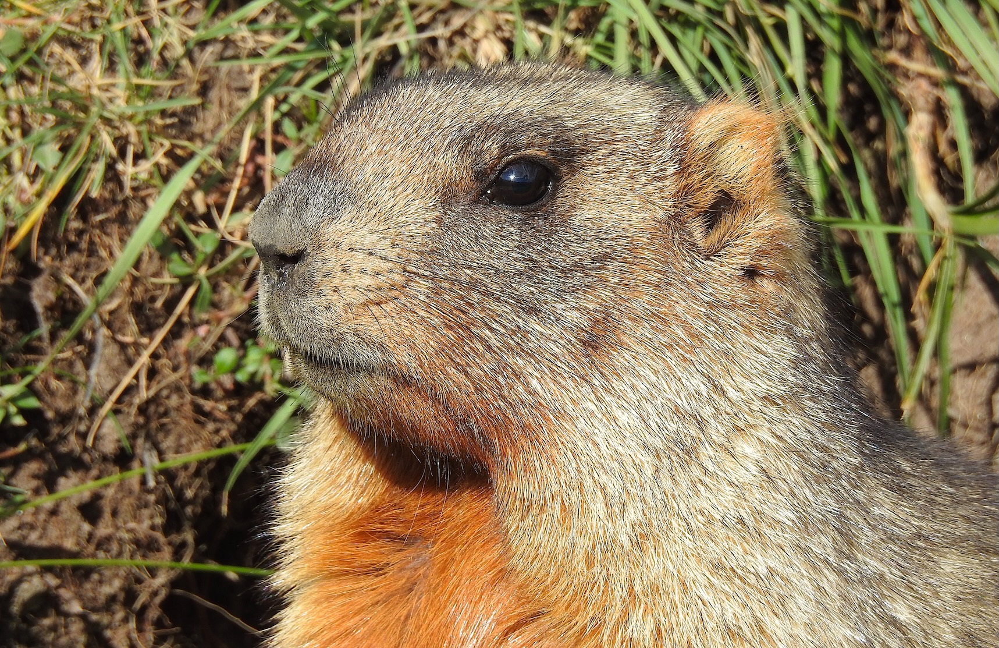
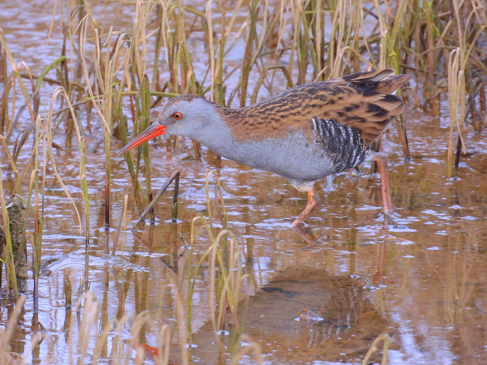

```{r setup, include=FALSE}  
knitr::opts_chunk$set(echo = TRUE)
``` 

<!-- {height=300px} {height=250px} -->
<!-- {height=350px} {height=350px} -->
<!-- {height=350px} {height=350px}  -->
<!-- {height=350px} {height=350px}  -->
<!-- {height=350px} {height=350px} -->
<!-- {height=350px} {height=350px} -->
<!-- {height=350px} {height=350px} -->
<!-- {height=350px} {height=350px} Rascon--> 
{height=350px} {height=350px}


## 2025-11-12 Session

+ [RNN_extra_slides.pdf](./2025_11_12_NeuralNetworks/RNN_extra_slides.pdf)


## 2025-11-05 Session

+ [Example of level shift](2025_11_05_Intervention/Level_shift_example.html)


## 2025-10-29 Session

+ Transfer functions for seasonal time series: [Lab7_TF_Seasonal_v2](2025_10_29_TransferFunctions_2/Lab7_TF_Seasonal_v2.html)
+ Transfer functions with more than one input: [Lab7_TF_two_inputs_example.R](2025_10_29_TransferFunctions_2/Lab7_TF_two_inputs_example.html)
+ [macro_data.csv](2025_10_29_TransferFunctions_2/macro_data.csv)


## 2025-10-22 Session


+ [Splits in Forecasting (via the Python `sktime` lbrary)](https://www.sktime.net/en/v0.24.2/examples/forecasting/window_splitters.html)

## 2025-10-08 Session 

+ <span style="color:red">Midterm 2023 statement available in Moodle</span>
+ [Dynamic Regression models](./2025_10_08_TransferFunctions_1/2025_10_08_Dynamic_Regression_1.html)
+ **Recommended reading:**  [Chapter 10 of @hyndman2021fpp3](https://otexts.com/fpp3/dynamic.html) and the corresponding videos. [Chapter 9 in @hyndman2021fpp2] covers the same ideas, but using previous versions of the R libraries, you may find it useful as well. [Section 5.5 of @shumwaystoffer2017](https://link.springer.com/book/10.1007/978-3-319-52452-8) deals with *Transfer Function Modeling*, but to read it you need the previous chapters material.


## 2025-10-01 Session 

+ <span style="color:red">Última semana para apuntarse</span> al [Acto de la Cátedra Endesa de Aplicaciones de la IA (21/10/2025)](https://sifo.comillas.edu/mod/url/view.php?id=3744630)
+ [SARIMA, lecture notes](./2025_10_01_SARIMA/2025_10_01_SARIMA.html)
+ **Recommended reading:**  [Sections 5.8 to 5.10 of @hyndman2021fpp3](https://otexts.com/fpp3/accuracy.html#accuracy) and the corresponding videos. The code for those sections uses a more advanced R syntax than our lab code, but the results are essentially the same. 


## 2025-09-24 Session 

+ [ARIMA, lecture notes](./2025_09_24_ARIMA/2025_09_24_ARIMA.html)
+ **Recommended reading:** [Chapter 9 of fpp2 up to Section 9.8 (inclusive)](https://otexts.com/fpp3/arima.html#arima). Also watch the videos in that chapter.


## 2025-09-17 Session 

+ [ARMA processes, lecture notes](./2025_09_17_ARMA/2025_09_17_ARMA.html)
+ **Recommended reading:** Same as the previous lecture, plus [Ch.11 of @Krispin2019](https://github.com/PacktPublishing/Hands-On-Time-Series-Analysis-with-R). For more mathematical background [up to Ch02 of @shumwaystoffer2017](https://link.springer.com/book/10.1007/978-3-319-52452-8) 


## 2025-09-10 Session 

+ [Lab 2 ARMA models, additional notes](./2025_09_10_StochasticProcess_ARMA/2025_09_10_StochasticProcess_ARMA.html)
+ **Recommended reading:** [Section 2.9 and Chapters 3 and 6 of fpp2](https://otexts.com/fpp2/). Also watch the videos in the corresponding [chapters of fpp3](https://otexts.com/fpp3/)
+ [Examples of MA process](./2025_09_10_StochasticProcess_ARMA/2025_09_10_StochasticProcess_ARMA_files/MA_examples.html)
+ [Python code](./2025_09_10_StochasticProcess_ARMA/2025_09_10_ARMA_Lecture_Python.html)


## 2025-09-03 Session 

+ [Lab. 1 Decomposition, additional notes](./2025_09_03_Decomposition/2025_09_03_Decomposition.html)
+ **Recommended reading:** [Chapters 1 and 2 of fpp2](https://otexts.com/fpp2/). Also watch the videos in the corresponding [chapters of fpp3](https://otexts.com/fpp3/)
+ [Forecasting: Principles and Practice, the Pythonic Way](https://otexts.com/fpppy/)
+ [Time-Series Forecasting: Deep Learning vs Statistics](https://medium.com/data-science/time-series-forecasting-deep-learning-vs-statistics-who-wins-c568389d02df). A Medium post (2023) by N. Kafritsas.
+ [Python code](./2025_09_03_Decomposition/Lab_1_Decomposition.html)


<!-- + [Lab. 1 Decomposition](Lab_1_Decomposition_grupoB_2.html)   -->
<!-- [R Source Code](Lab_1_Decomposition_grupoB_2.R)   -->
<!-- + [Lab. 1. Additional code, Stochastic Processes](Lab_1a_StochasticProcesses_grupoB.html)   -->
<!--   [R Source Code](Lab_1a_StochasticProcesses_grupoB .R) -->

<hr>

<!-- ## Lab 10 -->

<!-- + [RNN_extra_slides.pdf](RNN_extra_slides.pdf) -->


<!-- Recomendamos ver el siguiente vídeo para la próxima sesión:   -->
<!-- [Recurrent Neural Networks (RNN) and Long Short-Term Memory (LSTM) by Brandon Rohrer](https://www.youtube.com/watch?v=WCUNPb-5EYI) -->


<!-- + [Lab10_XGBoostForecasting.html](Lab10_XGBoostForecasting.html)   -->

<!-- + [Lab10_MLPforecasting_grupoB.html](Lab10_MLPforecasting_grupoB.html)   -->
<!--   [R Source Code](Lab10_MLPforecasting_grupoB.r)   -->

<!-- + [Lab10_FT_DemandTemperature_solution_grupoB.html](Lab10_FT_DemandTemperature_solution_grupoB.html)   -->
<!--   [R Source Code](Lab10_FT_DemandTemperature_solution_grupoB.r)   -->

<!-- ## Lab 8 -->

<!-- + [Lab8_DynamicRegressionModelsForecastingExample.html](Lab8_DynamicRegressionModelsForecastingExample.html) -->
<!-- + [Lab8_DynamicRegressionModelsForecastingExample.R](Lab8_DynamicRegressionModelsForecastingExample.R) -->
<!-- + [macro_econ_TR.csv](https://gist.githubusercontent.com/fsansegundo/4bdccfde57696118164f88a55c7d85ef/raw/4a9cf86f907a61fa47631094a7e84c7ca322d098/macro_econ_TR.csv).  -->
<!-- + [macro_econ_TS.csv](https://gist.githubusercontent.com/fsansegundo/4bdccfde57696118164f88a55c7d85ef/raw/4a9cf86f907a61fa47631094a7e84c7ca322d098/macro_econ_TS.csv) -->

<!-- ## Lab 7 -->

<!-- + [Lab7_DynamicRegressionModels_GrupoB.html](Lab7_DynamicRegressionModels_GrupoB.html)   -->
<!--   [R Source Code](Lab7_DynamicRegressionModels_GrupoB.r)   -->
<!-- + [Lab7_TF_Seasonal_GrupoB.R](Lab7_TF_Seasonal_GrupoB.R)   -->

<!-- ## Lab 6 -->

<!-- + [Lab6_Prophet_v7.html](Lab6_Prophet_v7.html)  -->

<!-- ## Lab 4 -->

<!-- + [Lab. 4 SARIMA models](Lab4_SARIMA__CarRegistrationsWithTV_GrupoB.html)  -->
<!--   [R Source Code](Lab4_SARIMA__CarRegistrationsWithTV_GrupoB.r) -->


<!-- + [Lab. 4 ARIMA models](Lab4_ARIMA_grupoB.html)   -->
<!--   [R Source Code](Lab4_ARIMA_grupoB.R) -->

<!-- + Suggested Reading: -->

<!--   - [Ch.09 of @hyndman2021fpp3, Sections 9.1 to 9.5](https://otexts.com/fpp3/arima.html#arima). For the second edition see -->
<!--   [Chapter 8 of FPP2, Sections 8.1 to 8.8](https://otexts.com/fpp2/arima.html#arima) -->
<!--   - [Ch.11 of @Krispin2019](https://github.com/PacktPublishing/Hands-On-Time-Series-Analysis-with-R) -->
<!--   - [Ch02 of @shumwaystoffer2017](https://link.springer.com/book/10.1007/978-3-319-52452-8)  -->


<!-- <hr> -->

<!-- ## Lab 2 -->

<!-- <div style="color:red">UPDATED (unified in a single document):</div> -->

<!-- + [Lab. 2 ARMA models](Lab_2_ARMA_grupoB.html)   -->
<!--   [R Source Code](Lab_2_ARMA_grupoB.R) -->


<!-- + Suggested Reading: -->

<!--   - [Ch.09 of FPP3, Sections 9.1 to 9.5](https://otexts.com/fpp3/arima.html#arima) -->
<!--   - [Ch.11 of @Krispin2019](https://github.com/PacktPublishing/Hands-On-Time-Series-Analysis-with-R) -->
<!--   - For more mathematical background [up to Ch02 of @shumwaystoffer2017](https://link.springer.com/book/10.1007/978-3-319-52452-8)  -->

<!-- <hr> -->

