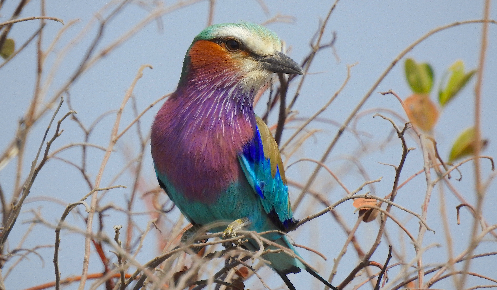
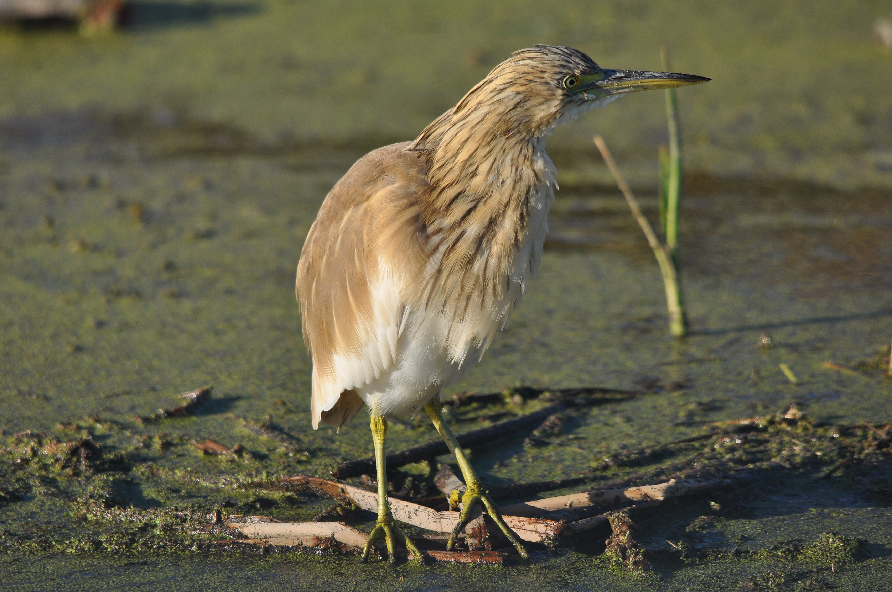
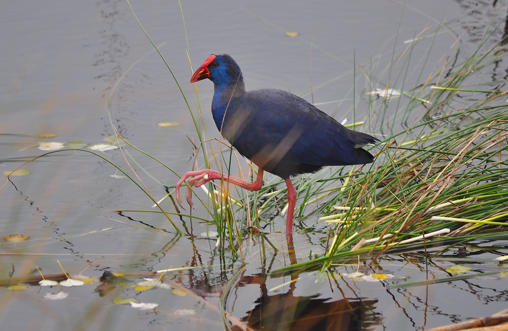
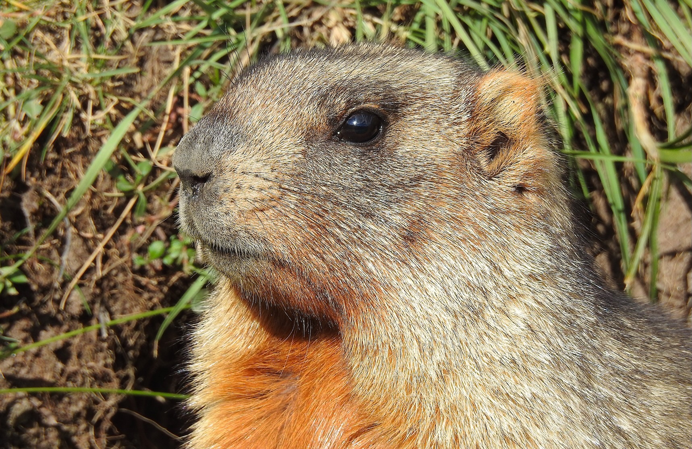
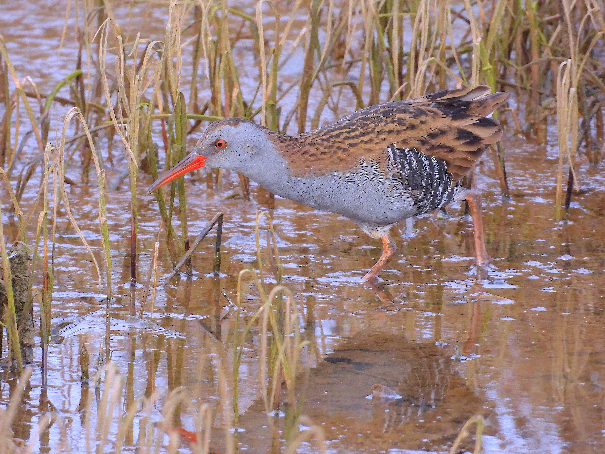
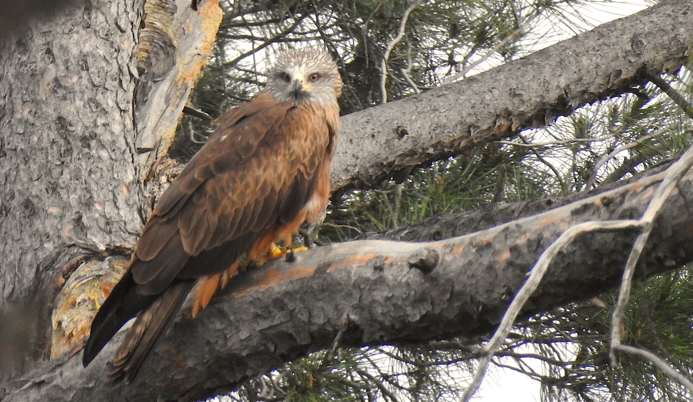
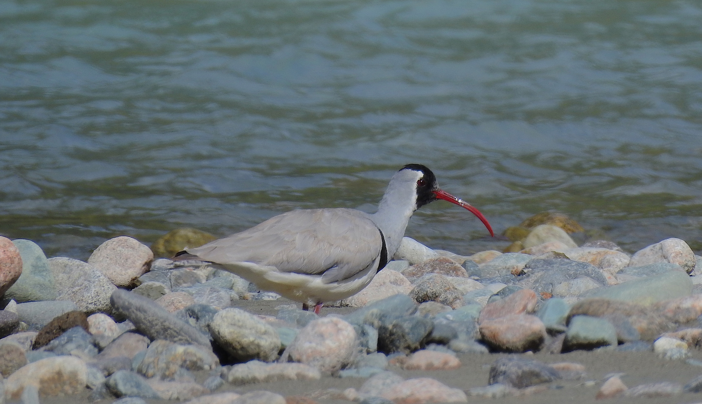
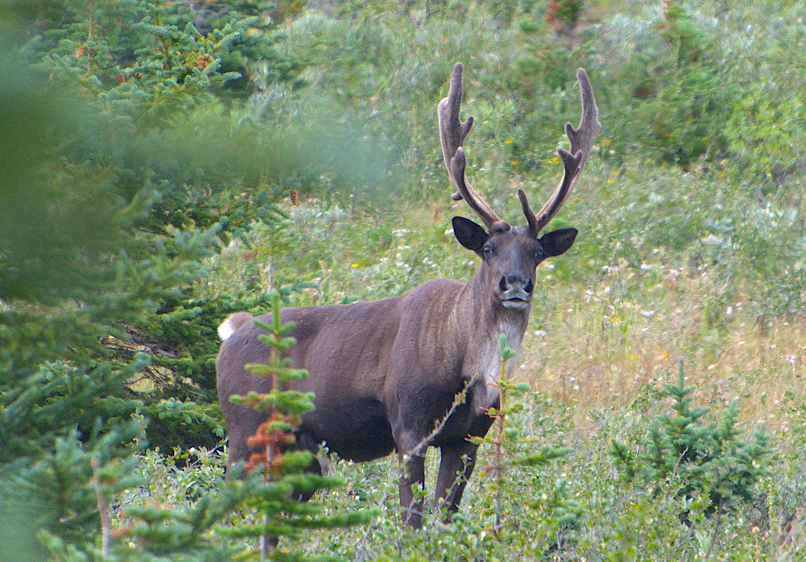

```{r setup, include=FALSE}  
knitr::opts_chunk$set(echo = TRUE)
``` 

{height=300px} {height=250px}
<!-- {height=350px} {height=350px} -->
<!-- {height=350px} {height=350px}  -->
<!-- {height=350px} {height=350px}  -->
<!-- {height=350px} {height=350px} -->
<!-- {height=350px} {height=350px} -->
<!-- {height=350px} {height=350px} -->
<!-- {height=350px} {height=350px} Rascon--> 
<!-- {height=350px} {height=300px} -->
<!-- {height=350px} {height=300px} -->
<!-- {height=350px} {height=300px} -->


## 2026-09-01 Session 

+ [Lab. 1 Decomposition, additional notes](./2026_09_01_Decomposition/2026_09_01_Decomposition.html)
+ **Recommended reading:** [Chapters 1 and 2 of fpp2](https://otexts.com/fpp2/). Also watch the videos in the corresponding [chapters of fpp3](https://otexts.com/fpp3/)
+ [Forecasting: Principles and Practice, the Pythonic Way](https://otexts.com/fpppy/)
+ [Time-Series Forecasting: Deep Learning vs Statistics](https://medium.com/data-science/time-series-forecasting-deep-learning-vs-statistics-who-wins-c568389d02df). A Medium post (2023) by N. Kafritsas.
<!-- + [Python code](./2025_09_03_Decomposition/Lab_1_Decomposition.html) -->


<hr>


